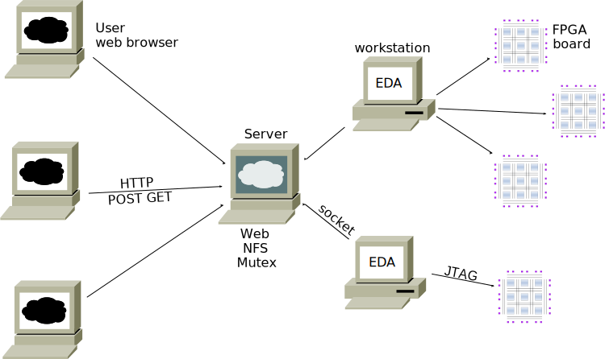

These are the server files that allow using FPGA boards remotely,
and also do simulation remotely, using a web browser.

These files are stored here only for reference.

#### Web server: HTTP+NFS+MUTEX server
```
/var/www/html/hdl
   simulate.php
   remote.php
   remote.js
   send_sse.php
   client.php
   fpga.html

/labarc/TOP  (these files get copied to a directory in /home/labarc01)
   DE0_Nano.sv
   DE0_SOC.sv     and also .qpf .qsf .sdc, /home/labarc01/syn only
   Makefile    /home/labarc01/syn and /home/labarc01/sim
```
#### EDA workstations: NFS clients and JTAG servers where FPGA boards are connected
```
/labarc/util
   sim_socket.o (compiled from sim_socket.cpp with -DLAD)
   veri.cpp
   vJTAG_interface.sv
   qr.tcl
```
#### NFS mounted /home/labarc01 in Web server and EDA workstations
```
   launch_sims
   launch.sh
   launch
   search_copy_TOP
   search_copy_TOP_server
```
### How it works

HTTP server, NFS server, MUTEX server, and SSH server are running on the same computer.
The `/home` directory is shared via NFS.
The MUTEX server process `search_copy_TOP_server` is running
from the `labarc01` account.
The HTTP server has write access to /home/labarc01/sim and /home/labarc01/syn.

When the user clicks `Upload` in `remote.php` or `simulate.php`,
the HTTP server creates a new directory in `/home/labarc01/syn` or `/home/labarc01/sim`, respectively,
and puts the uploaded Systemverilog file `top.sv` into it.
The HTTP server has no FPGA board connected to it nor does it run simulations.

The simulations are run by one specific computer. One process of `launch_sims`
is running on account `labarc01` on this computer. This process looks for a
directory in `/home/labarc01/sim` which has exactly one file in it.
If it finds such a directory, it copies `Makefile` from `/labarc/TOP` into it
and detaches a new process running `make sim`, which starts a socket server.

FPGA boards are connected to several computers which are all NFS clients.
There is a `launch` command running, one for each FPGA board.
The `launch` commands are started by user labarc01 according to `labarc.sh`.
Periodically, the `launch` command tries to connect to the MUTEX server.

The MUTEX server allows only one connection at a time.
The MUTEX server executes the comamnd `search_copy_TOP`, which looks for a
directory in `/home/labarc01/syn` which has exactly one file in it.
If it finds such a directory, it copies files from `/labarc/TOP` into it
and then returns the directory name to the `launch` command.

When a `launch` command obtains a diretory name, it performs synthesis,
configures its FPGA board, and starts a JTAG socket server using `qr.tcl`.

Output messages from both, simulation and synthesis, 
are put into a log file which is periodically being read
by the user's browser using `send_sse.php`.
After starting the socket server, an output message is sent informing the computer
name and the socket number. The user's browser runs `remote.js` which uses
this information to make requests to the socket server via `client.php`.
Both, simulation and JTAG socket server requests, use the same protocol.
The return values from these requests animate the graphical interface
of the GUI in `fpga.html`.

Closing the browser tab of window os clicking on the `Browse...` or `Upload` button
sends an exit message to the socket server. This makes the FPGA available for
another run or ends the simulation process, respectively.
If no such exit message is received, the JTAG server is killed after 5 minutes
and the simulation is killed after 1 hour.


