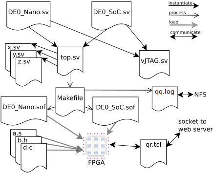

These are the server files that allow using FPGA boards remotely,
and also do simulation remotely, using a web browser.

These files are stored here only for reference.

#### Web server: HTTP+NFS+MUTEX server
```
/var/www/html/hdl
   simulate.php
   remote.php
   remote.js
   send_sse.php
   client.php
   fpga.html

/labarc/TOP  (these files get copied to a directory in /home/labarc01)
   DE0_Nano.sv
   DE0_SOC.sv     and also .qpf .qsf .sdc, /home/labarc01/syn only
   Makefile    /home/labarc01/syn and /home/labarc01/sim
```
#### EDA workstations: NFS clients and JTAG servers where FPGA boards are connected
```
/labarc/util
   sim_socket.o (compiled from sim_socket.cpp with -DLAD)
   veri.cpp
   vJTAG_interface.sv
   qr.tcl
```
#### NFS mounted /home/labarc01 in Web server and EDA workstations
```
   launch_sims
   launch.sh
   launch
   search_copy_TOP
   search_copy_TOP_server
```
### How it works

HTTP server, NFS server, and MUTEX server are running on the same computer.
The `/home` directory is shared via NFS.
The MUTEX server process `search_copy_TOP_server` is running
from the `labarc01` account.
The HTTP server has write access to both, `/home/labarc01/sim` and `/home/labarc01/syn`.

When the user clicks `Upload` in `remote.php` or `simulate.php`,
the HTTP server creates a new directory in `/home/labarc01/syn` or `/home/labarc01/sim`, respectively,
and puts the uploaded Systemverilog file `top.sv` or `top.zip`into it.

Optionally, before clicking `Upload`,
the user may activate one of two different LCD views:
a plain hex display for two 64-bit values, or
a view of internal processor busses and control signals
which is used when the intended project is the
implementation of a RISC-V processor.
A datapath register view is also provided in this case.

The HTTP server has no FPGA board connected to it nor does it run simulations.

The simulations are run by one specific computer. One process of `launch_sims`
is running on account `labarc01` on this computer. This process looks for a
directory in `/home/labarc01/sim` which has exactly one file in it.
If it finds such a directory, it copies `Makefile` from `/labarc/TOP` into it
and detaches a new process running `make sim`, which starts a socket server.

FPGA boards are connected to several computers which are all NFS clients.
There is a `launch` command running, one for each FPGA board.
The `launch` commands are started by user labarc01 according to `labarc.sh`.
Periodically, the `launch` command tries to connect to the MUTEX server.

The MUTEX server allows only one connection at a time.
The MUTEX server executes the comamnd `search_copy_TOP`, which looks for a
directory in `/home/labarc01/syn` which has exactly one file in it.
If it finds such a directory, and if the one file is a `.zip` it unzips it.
It copies files from `/labarc/TOP` into the directory
and then returns the directory name to the `launch` command.

When a `launch` command obtains a diretory name, it performs synthesis,
configures its FPGA board, and starts a JTAG socket server using `qr.tcl`.

Output messages from both, simulation and synthesis, 
are put into a log file which is periodically being read
by the user's browser using `send_sse.php`.
After starting the socket server, an output message is sent informing the computer
name and the socket number. The user's browser runs `remote.js` which uses
this information to make requests to the socket server via `client.php`.
Both, simulation and JTAG socket server requests, use the same protocol.
The return values from these requests animate the graphical interface
of the GUI in `fpga.html`.

Closing the browser tab of window os clicking on the `Browse...` or `Upload` button
sends an exit message to the socket server. This makes the FPGA available for
another run or ends the simulation process, respectively.
If no such exit message is received, the JTAG server is killed after 5 minutes
and the simulation is killed after 1 hour.


In order to be able to support two models of FPGA boards available in the lab,
there are two top level SystemVerilog files:
`DE0_Nano.sv` for the Terasic DE0-Nano Development and Education Board and
`DE0_SoC.sv` for the Terasic DE0-Nano-SoC Kit/Atlas-SoC Kit.
Both files are kept on the lab server and can not be modified by the user.
The user uploads the file `top.sv` which is instantiated in `DE0_Nano.sv`
as well as in `DE0_SoC.sv`. By means fo the file `top.sv`, the user does not
need to be aware in which FPGA board model his circuit will be implemented.
Depending on FPGA boards and computers available at the time of upload,
the circuit descibed in `top.sv` may get implemented in any board model.

By means of the parameter `divide_by` defined in `top.sv`, the user can set
the clock frequency of the clock signal input to `top.sv`.
The parameter is used in a clock divider circuit in `DE0_Nano.sv` and `DE0_SoC.sv`.

The files `DE0_Nano.sv` and `DE0_SoC.sv` also instatiate the virtual JTAG module
contained in file `vJTAG_interface.sv` which in turn instatiates
the `vJTAG` macrofunction
[(Zeh, 2012)](http://idlelogiclabs.com/2012/04/15/talking-to-the-de0-nano-using-the-virtual-jtag-interface).

Along with the file `top.sv`, the user may provide additional SystemVerilog
files which contain modules instatiated in top.sv.

In case the Systemverilog description supplied by the user contains a
ROM megafunction named "INST", the user may also upload assembly and/or C files
along with the SystemVerilog files.
This feature is used when a RISC-V processor circuit is to be implemented in the FPGA.

All file processing is governed by a `Makefile` which uses Quartus Design Software
command line interface to synthesize the circuit from the SystemVerilog files.
Depending on the FPGA board model connected to the computer to which the job
has been assigned to by the web server, either a `DE0_nano.sof` or a `DE0_SoC.sof`
configuration file is created and loaded into the FPGA.
Assembly files and C files are compiled using the
[RISC-V toolchain](https://github.com/riscv/riscv-gnu-toolchain)
and the raw binary data are loaded into the FPGA ROM memory instance called "INST"
by means of Quartus Design Software command line interface.

The TCL command file `qr.tcl` supplied to the Quartus SignalTap then
creates a socket server
[(Zeh, 2012)](http://idlelogiclabs.com/2012/04/15/talking-to-the-de0-nano-using-the-virtual-jtag-interface)
to which the web server can connect to.
The web server relays the socket connection via HTTP to the user's browser.

Incoming user actions from the user's GUI are fed to the virtual JTAG interface
to the inputs of the module in `top.sv` and outputs are sent back
through the virtual JTAG interface and through the web server to the user's
browser Javascript GUI.



